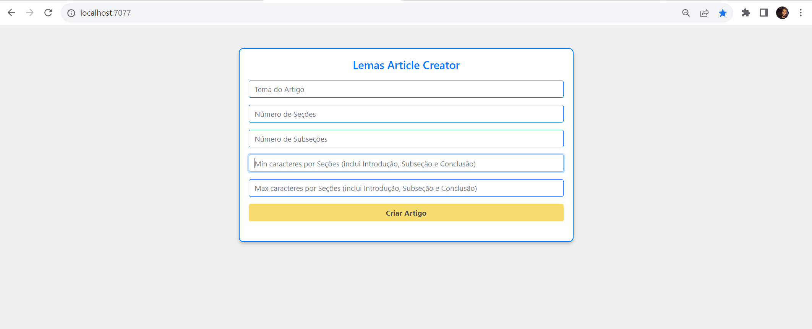
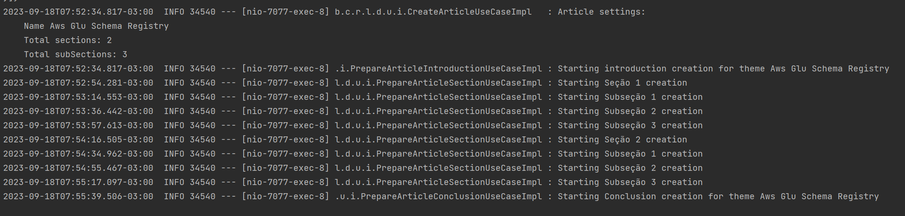
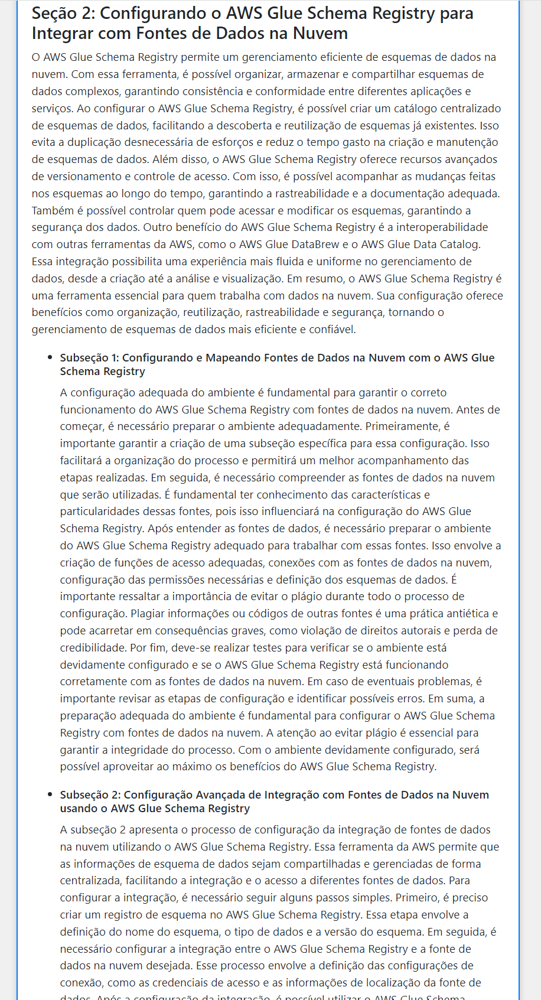
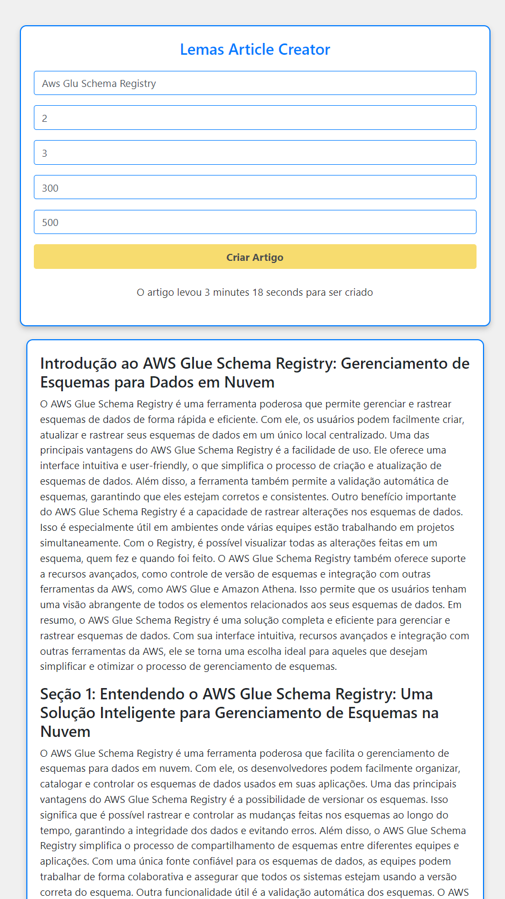

# lems-ai


### Running Jacoco coverage
```
./gradlew build jacocoTestReport
```

### Building App
```
./gradlew clean build
```

### Running App
```
cd /build/libs
java -jar .\lems-ai-0.0.1-SNAPSHOT.jar --server.port=8001 --openai.api.key=OPENAI_API_KEY

http://localhost:8001
```

#### The app


#### Executing


#### Formatting


#### Result

